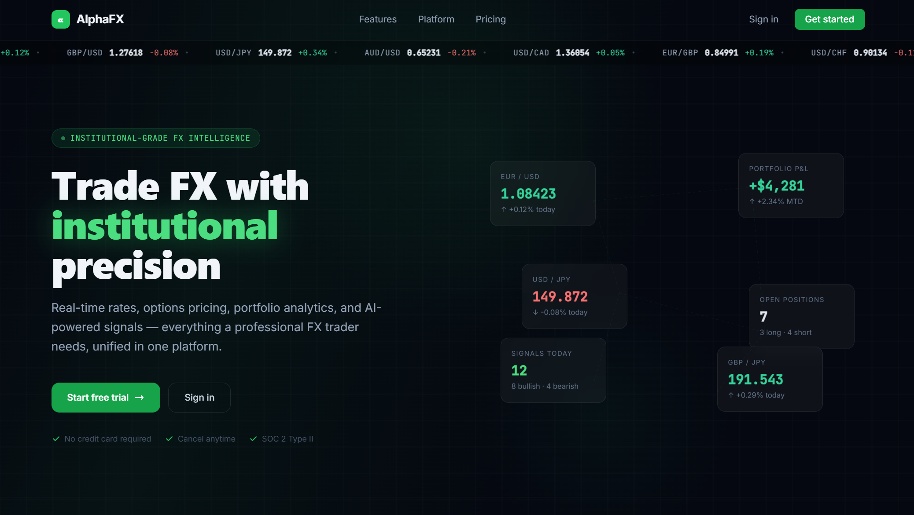

# AlphaFX


## Institutional FX Analytics and Trading Intelligence Platform

AlphaFX is an FX analytics platform: a Django backend (REST plus a real Django Channels WebSocket for live tick streaming) for rates, portfolio, and technical analysis, paired with a separate FastAPI AI microservice and a TypeScript React frontend. The AI service's four models, an LSTM forecaster (optional PyTorch), an HMM regime detector (optional hmmlearn), a GARCH volatility model (optional arch), and a FinBERT sentiment analyzer (with a rule-based fallback), are genuine implementations, each degrading gracefully when its optional dependency isn't installed.

<div align="center">
  
</div>

## Table of Contents

- [Overview](#overview)
- [Project Structure](#project-structure)
- [Feature Status](#feature-status)
- [Technology Stack](#technology-stack)
- [Architecture](#architecture)
- [Installation and Setup](#installation-and-setup)
- [Running the Stack](#running-the-stack)
- [API Surface](#api-surface)
- [Testing](#testing)
- [CI/CD Pipeline](#cicd-pipeline)
- [Documentation](#documentation)
- [Contributing](#contributing)
- [License](#license)

## Overview

AlphaFX demonstrates an FX analytics and trading-intelligence workflow across a real, runnable codebase. The Django backend and the separate FastAPI AI microservice are two independently deployable services, each with its own test suite. CI currently only runs the backend's 88 tests; the AI service's own 28-function test suite isn't wired into the workflow.

## Project Structure

```
AlphaFX/
├── code/
│   ├── backend/                  # Django application
│   │   ├── alphafx/              # Project config: settings, ASGI (Channels), URLs
│   │   ├── apps/                 # core, auth_api, rates (WebSocket consumer),
│   │   │                         # portfolio, technical, analytics
│   │   └── tests/                # Backend test suite
│   └── ai_services/              # Separate FastAPI microservice
│       ├── api/main.py           # FastAPI app
│       ├── models/               # lstm_forecaster (optional PyTorch),
│       │                         # regime_detector (optional hmmlearn),
│       │                         # garch_vol (optional arch), anomaly_detector
│       │                         # (optional scikit-learn IsolationForest)
│       ├── services/             # sentiment (FinBERT, rule-based fallback),
│       │                         # signal_aggregator (combines all four models)
│       ├── training/             # train_all.py
│       └── tests/                # AI service's own test suite (not run in CI)
├── frontend/                     # React (Vite), TypeScript, Tailwind CSS
├── infrastructure/               # Nginx reverse proxy, Kubernetes manifests
├── scripts/                      # dev, db, deploy, ai, and maintenance scripts
├── docs/                         # Numbered documentation set (01 through 09)
├── docker-compose.yml            # Full stack: db, redis, backend,
│                                 # ai_services, frontend, nginx
└── README.md
```

## Feature Status

### Application tier (wired and tested)

| Component                  | Details                                                                                                                                                                                     |
| :------------------------- | :------------------------------------------------------------------------------------------------------------------------------------------------------------------------------------------ |
| **API**                    | Django REST backend covering auth, rates, portfolio, technical analysis, and analytics, plus a real Django Channels WebSocket consumer streaming live FX rate ticks.                        |
| **Quant pricing**          | Garman-Kohlhagen FX option pricing and covered interest parity forward pricing, genuinely implemented in the backend's core pricing module and used by the rates and analytics views.       |
| **LSTM forecaster**        | A real PyTorch LSTM in the AI microservice, guarded by a try/except import so the service still runs (with the feature unavailable) if PyTorch isn't installed.                             |
| **HMM regime detector**    | A real Gaussian HMM (via `hmmlearn`) for market regime classification, with the same optional-dependency pattern.                                                                           |
| **GARCH volatility model** | A real GARCH implementation (via the `arch` library), with the same optional-dependency pattern.                                                                                            |
| **Sentiment analysis**     | A real FinBERT (`ProsusAI/finbert`) transformer model for headline sentiment, with a rule-based fallback if the model can't be loaded, plus currency detection and a macro sentiment index. |
| **Anomaly detection**      | A real scikit-learn Isolation Forest, guarded by the same optional-dependency pattern.                                                                                                      |
| **Signal aggregation**     | A dedicated service that combines the LSTM, regime, GARCH, sentiment, and technical scores into one aggregate signal.                                                                       |
| **Web frontend**           | React and TypeScript app (Vite, Tailwind CSS) consuming both the Django REST API and the live WebSocket tick stream.                                                                        |

## Technology Stack

| Area                         | Technology                                                                                 |
| :--------------------------- | :----------------------------------------------------------------------------------------- |
| Backend                      | Django 5, Django REST Framework, Django Channels (WebSocket)                               |
| AI microservice              | Python, FastAPI (a separate service from the Django backend)                               |
| Data layer                   | PostgreSQL in production, Redis for caching and Channels' channel layer                    |
| Deep learning (optional)     | PyTorch, for the LSTM forecaster                                                           |
| Regime detection (optional)  | hmmlearn (Gaussian HMM)                                                                    |
| Volatility (optional)        | The `arch` library, for GARCH                                                              |
| Sentiment                    | A FinBERT transformer model, with a rule-based fallback                                    |
| Anomaly detection (optional) | scikit-learn (Isolation Forest)                                                            |
| Web frontend                 | React 18, TypeScript, Vite, Tailwind CSS                                                   |
| Infrastructure               | Docker, Docker Compose, Kubernetes, Nginx                                                  |
| CI/CD                        | GitHub Actions                                                                             |
| Testing                      | pytest (backend, 88 tests, run in CI; the AI service's 28 tests run locally but not in CI) |

## Architecture

```
Client
  └── frontend (React, TypeScript, Vite)   ── HTTP/WebSocket ──┐
                                                                ▼
Backend (Django, REST + Channels WebSocket)
  ├── Apps    core, auth_api, rates (WebSocket consumer), portfolio,
  │           technical, analytics
  ├── Pricing   Garman-Kohlhagen options, covered interest parity forwards
  └── Data layer  PostgreSQL, Redis

AI microservice (FastAPI, a separate deployable service)
  lstm_forecaster (optional PyTorch) · regime_detector (optional hmmlearn)
  garch_vol (optional arch) · anomaly_detector (optional scikit-learn)
  sentiment (FinBERT, rule-based fallback) · signal_aggregator
```

See the [numbered documentation set](#documentation) for detail, starting with `docs/01_overview.md` and `docs/02_architecture.md`.

## Installation and Setup

Prerequisites: Python 3.11+, Node.js 18+, and Docker.

```bash
git clone https://github.com/quantsingularity/AlphaFX.git
cd AlphaFX
cp .env.example .env
```

For local (non-Docker) development, see `docs/06_setup_and_deployment.md` and `scripts/dev/`.

## Running the Stack

```bash
docker compose up --build
```

| Endpoint         | URL                                    |
| :--------------- | :------------------------------------- |
| Platform         | `http://localhost`                     |
| Django API docs  | `http://localhost:8000/docs/`          |
| AI service docs  | `http://localhost:8001/docs`           |
| Admin panel      | `http://localhost:8000/admin/`         |
| Live tick stream | `ws://localhost:8000/ws/rates/EURUSD/` |

## API Surface

See `docs/03_api_reference.md` for the full endpoint reference with request and response schemas, and `docs/07_frontend_guide.md` for how the frontend consumes it.

## Testing

```bash
# Backend (from code/backend)
pytest

# AI service (from code/ai_services)
pytest
```

| Suite              | Test count | Run in CI             |
| :----------------- | :--------- | :-------------------- |
| `code/backend`     | 88         | Yes                   |
| `code/ai_services` | 28         | No, runs locally only |

See `docs/08_testing_guide.md` for test classes and key assertions.

## CI/CD Pipeline

GitHub Actions (`.github/workflows/cicd.yml`) runs three jobs on push, pull request, and manual dispatch:

| Job                 | Depends on          | What it does                                                                                                                                           |
| :------------------ | :------------------ | :----------------------------------------------------------------------------------------------------------------------------------------------------- |
| Code Quality Checks | -                   | Formatter checks across the repository                                                                                                                 |
| Backend Tests       | Code Quality Checks | Runs `pytest tests/` from the Django backend directory with coverage, and uploads the report as an artifact. Does not run the AI service's test suite. |
| Frontend Build      | Code Quality Checks | Installs dependencies and produces the production web build (no test step)                                                                             |

## Documentation

| Document                                                           | Contents                                                               |
| :----------------------------------------------------------------- | :--------------------------------------------------------------------- |
| [docs/01_overview.md](docs/01_overview.md)                         | Feature matrix, architecture summary                                   |
| [docs/02_architecture.md](docs/02_architecture.md)                 | Service topology, database schema, caching strategy                    |
| [docs/03_api_reference.md](docs/03_api_reference.md)               | Full endpoint reference with request and response schemas              |
| [docs/04_quantitative_models.md](docs/04_quantitative_models.md)   | Garman-Kohlhagen options, covered interest parity forwards, indicators |
| [docs/05_ai_ml_services.md](docs/05_ai_ml_services.md)             | LSTM, HMM, GARCH, anomaly detection, and sentiment details             |
| [docs/06_setup_and_deployment.md](docs/06_setup_and_deployment.md) | Local development, Docker, production checklist                        |
| [docs/07_frontend_guide.md](docs/07_frontend_guide.md)             | Pages, components, API client, conventions                             |
| [docs/08_testing_guide.md](docs/08_testing_guide.md)               | Test classes, key assertions, CI pipeline                              |
| [docs/09_changelog.md](docs/09_changelog.md)                       | Version history and feature additions                                  |
| [scripts/README.md](scripts/README.md)                             | All scripts, with usage examples                                       |

## Contributing

Open a pull request.

## License

This project is licensed under the MIT License - see the [LICENSE](LICENSE) file for details.
